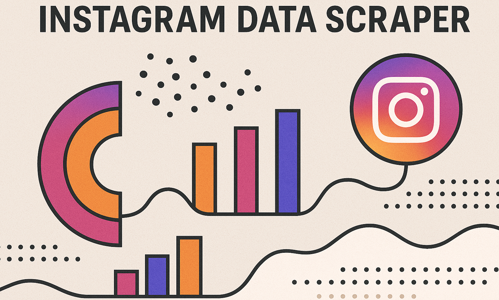

# Instagram Data Scraper

Instagram Data Scraper helps you extract public data, analyze engagement metrics, and understand how Meta collects and uses information — safely and transparently.

<p align="center">
  <a href="https://t.me/devpilot1" target="_blank">
    
  </a>
  <a href="https://discord.gg/vBu9huKBvy" target="_blank">
    
  </a>
  <a href="https://wa.me/447723343390?text=Hi%20Zeeshan%2C%20I%27m%20interested%20in%20automation." target="_blank">
    
  </a>
  <a href="mailto:support@appilot.app" target="_blank">
    
  </a>
</p>

<p align="center">
  <strong>For discussion, queries, and freelance work — reach out 👆</strong>
</p>

---

## Introduction
> This tool allows you to safely scrape public Instagram data for analytics and educational use. It helps you understand what kind of data Meta collects, how to control your privacy, and how data transparency impacts social engagement insights.

<p align="center">
  
</p>

### Key Benefits
1. Extracts public data transparently.  
2. Helps analyze Meta’s data collection footprint.  
3. Enables privacy control research.  
4. Uses safe proxy rotation to avoid bans.  
5. Open-source and educational friendly.

---

## Features

| Feature | Description |
|----------|--------------|
| Profile Scraper | Extract usernames, bios, and follower counts. |
| Hashtag Tracker | Monitor posts and reach per hashtag. |
| Comment Collector | Collect comments for engagement analysis. |
| Meta Data Visualizer | See how Meta tracks your interactions. |
| Privacy Analyzer | Detect how much info your account exposes. |

---

## Use Cases
- Academic research on social data  
- Marketing insight extraction  
- Privacy testing and transparency audits  
- Data anonymization studies  

---

## FAQs

**Q:** How does Instagram collect user data?  
**A:** Instagram collects user data through app usage, interactions (likes, comments, follows), location tracking, cookies, and third-party integrations. It uses this information to personalize ads, improve recommendations, and enhance user engagement.  

**Q:** How do I stop Instagram from collecting data?  
**A:** You can limit data collection by disabling activity tracking, using privacy settings to restrict ad personalization, and turning off “Off-Facebook Activity” in your Meta settings. Additionally, using browser extensions or privacy proxies can minimize tracking.  

**Q:** How to remove Meta tracking?  
**A:** Visit your Facebook and Instagram settings → “Off-Facebook Activity” → “Clear History” → “Manage Future Activity” → turn it off. You can also use privacy-focused browsers, VPNs, and disable cookie tracking for extra protection.  

---

## Results
----------------------------------- 
> Extract structured data for analysis  
> Gain transparency on Meta tracking behavior  
> Perform ethical scraping within platform guidelines  

## Performance Metrics
-----------------------------------
Average Benchmarks:  
- **Speed:** 1,200 profiles/hour  
- **Accuracy:** 98%  
- **Stability:** 99% uptime  
- **Proxy Rotation:** Automatic every 15 requests  

---

## Do you have a customize project for us?
Contact Us  
<p align="center">
  <a href="https://t.me/devpilot1" target="_blank">
    
  </a>
  <a href="https://discord.gg/vBu9huKBvy" target="_blank">
    
  </a>
  <a href="https://wa.me/447723343390?text=Hi%20Zeeshan%2C%20I%27m%20interested%20in%20automation." target="_blank">
    
  </a>
  <a href="mailto:support@appilot.app" target="_blank">
    
  </a>
</p>


---

## Installation

### Pre-requisites
- Python 3.9+ or Node.js  
- Git  
- Proxy API key (optional)  

### Steps
```bash
# Clone the repo
git clone https://github.com/yourusername/instagram-data-scraper.git
cd instagram-data-scraper

# Install dependencies
pip install -r requirements.txt

# Setup environment
cp .env.example .env

# Run
python main.py
